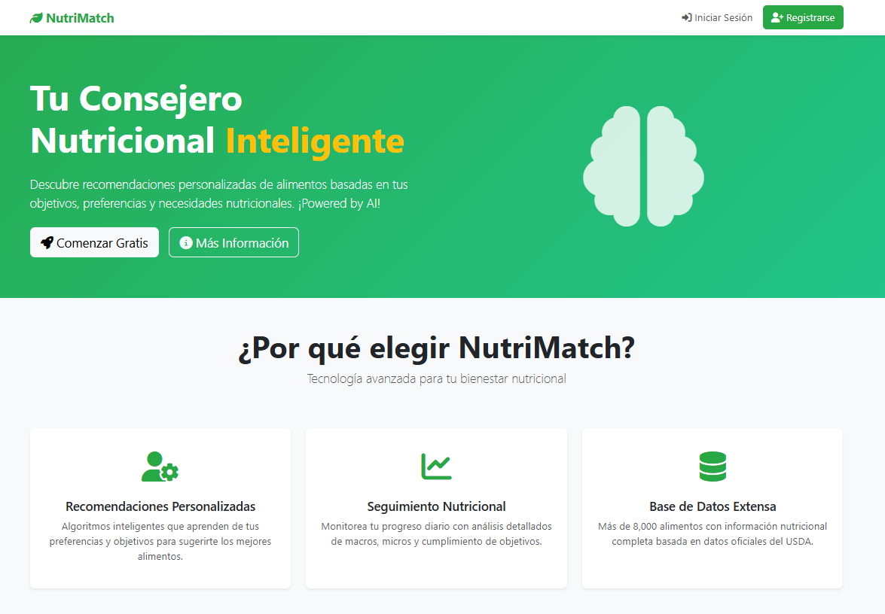
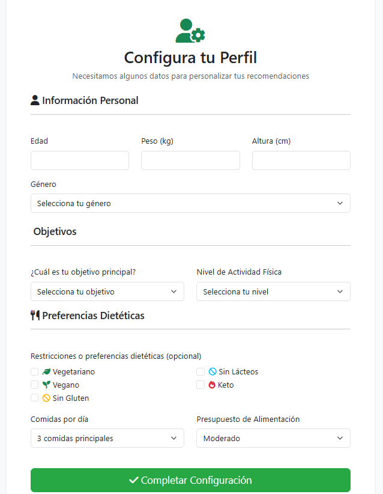
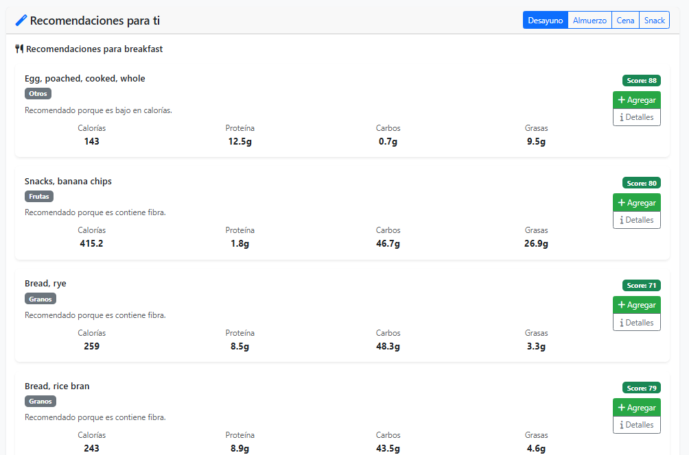
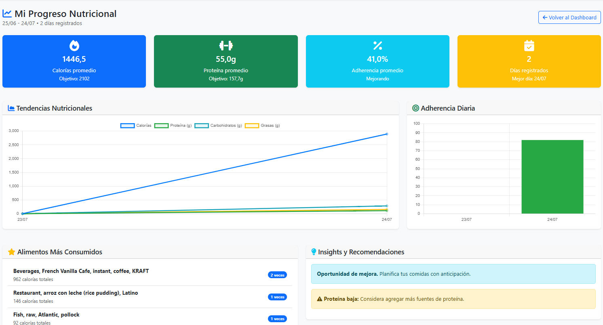

# 🥗 NutriMatch - Sistema de Recomendación Nutricional Inteligente

## 📋 Descripción del Proyecto

**NutriMatch** es un sistema de recomendación nutricional inteligente desarrollado con Django que utiliza algoritmos de machine learning para proporcionar sugerencias personalizadas de alimentos basadas en los objetivos, preferencias y patrones de consumo de cada usuario.

---

## ✨ Características Principales

### 🧠 Sistema de Recomendación Inteligente

### 📊 Seguimiento Nutricional Completo

### 🔍 Base de Datos Nutricional Extensa

### 👤 Personalización Avanzada

### 📈 Análisis y Progreso


---

## 🛠️ Stack Tecnológico

### Backend
- **Framework:** Django 4.2 + Django REST Framework  
- **Base de Datos:** MySQL  
- **Machine Learning:** Scikit-learn, NumPy, Pandas  
- **APIs Externas:** USDA FoodData Central API  

### Frontend
- **Plantillas:** HTML5, CSS3, Bootstrap 5  
- **JavaScript:** Vanilla JS + Chart.js para visualizaciones  
- **UI/UX:** Diseño responsive y moderno  

### Arquitectura
- **Patrón:** MVT (Model-View-Template) de Django  
- **APIs:** RESTful para integración con aplicaciones externas  
- **Autenticación:** Sistema de usuarios personalizado con perfiles extendidos  

---

## 🚀 Funcionalidades Implementadas

### Sistema de Usuarios
- ✅ Registro y autenticación completa
  📸 ****
- ✅ Configuración de perfil nutricional personalizado
- ✅ Gestión de preferencias y restricciones dietéticas
  📸 ****

### Motor de Recomendaciones
- ✅ Algoritmo híbrido de recomendación  
- ✅ Recomendaciones contextuales por horario de comida  
- ✅ Sistema de scoring multifactorial  
- ✅ Aprendizaje automático basado en feedback del usuario
  📸 ****

### Gestión de Alimentos
- ✅ Base de datos de 8,000+ alimentos  
- ✅ Búsqueda avanzada con autocompletado  
- ✅ Importación de datos desde CSV  
- ✅ Integración con USDA API  

### Seguimiento y Análisis
- ✅ Registro de consumo diario  
- ✅ Dashboard con métricas en tiempo real  
- ✅ Gráficos de progreso histórico  
- ✅ Sistema de calificación de alimentos
  📸 ****

---


## 🔬 Algoritmos y Machine Learning

### Motor de Recomendación
- **Filtrado Colaborativo:** Basado en similitud entre usuarios  
- **Filtrado por Contenido:** Análisis de propiedades nutricionales  
- **Optimización Nutricional:** Balanceo automático de macronutrientes  
- **Diversidad:** Algoritmos para evitar monotonía alimentaria  

### Análisis Predictivo
- Predicción de adherencia a objetivos  
- Identificación de patrones de consumo  
- Recomendaciones proactivas de ajustes nutricionales  
- Análisis de tendencias de salud  

---

## 🧪 Instalación y Ejecución

### 1. Clona el repositorio
```bash
git clone https://github.com/alex-raul/nutrimatch-sistema-de-recomendacion-inteligente2.git
```bash
cd nutrimatch-sistema-de-recomendacion-inteligente2
```
### 2. Crear entorno virtual
# Windows
```bash
python -m venv venv
venv\Scripts\activate
```
# 3. Instalar dependencias
```bash
pip install -r requirements.txt
```
##  Configura las variables de entorno
Crea un archivo .env en la raíz del proyecto y agrega lo siguiente:
```bash
# .env
SECRET_KEY='django-insecure-06a97tg1dx-$6mucbrzm=u#fy@j_-covk&pj^6fsxy*yf_oes3'
DEBUG=True

# Base de datos MySQL
DB_NAME=nutrimatch_db
DB_USER=root
DB_PASSWORD=......
DB_HOST=localhost
DB_PORT=3306

# API Keys
# USDA_API_KEY=your-api-key-here
```


## 5. Aplica migraciones de la base de datos
```bash
python manage.py makemigrations
python manage.py migrate
```

## 6. Ejecuta el servidor de desarrollo
```bash
python manage.py runserver
```
